<div align="center">

# ✈️ Predictive Maintenance with MLOps

### End-to-End Machine Learning System for Aircraft Engine RUL Prediction

[](https://python.org)
[](https://fastapi.tiangolo.com)
[](https://mlflow.org)
[](https://docker.com)
[](https://aws.amazon.com)
[](https://grafana.com)
[](LICENSE)

<br/>

> **A production-grade MLOps pipeline that predicts the Remaining Useful Life (RUL) of aircraft turbofan engines using the NASA C-MAPSS dataset — featuring real-time inference, experiment tracking, containerized deployment, and live monitoring.**

<br/>

| 🎯 Validation R² | 📉 Validation RMSE | 🔁 Total Predictions | ⚙️ Model Type |
|:---:|:---:|:---:|:---:|
| **0.997** | **3.75** | **12,345+** | **RandomForestRegressor** |

</div>

---

## 📌 Table of Contents

- [Overview](#-overview)
- [Project Proposal & Milestones](#-project-proposal--milestones)
- [Live Dashboard](#-live-dashboard)
- [Tech Stack](#-tech-stack)
- [Architecture](#-architecture)
- [Project Structure](#-project-structure)
- [Dataset](#-dataset)
- [ML Model & Results](#-ml-model--results)
- [Getting Started](#-getting-started)
- [MLflow Experiment Tracking](#-mlflow-experiment-tracking)
- [Monitoring — Prometheus & Grafana](#-monitoring--prometheus--grafana)
- [AWS Deployment](#-aws-deployment)
- [CI/CD Pipeline](#-cicd-pipeline)
- [API Reference](#-api-reference)
- [Author](#-author)

---

## 🔭 Overview

This project implements a **fully operationalized machine learning system** for predictive maintenance of aircraft engines. Given real-time sensor readings, the system predicts how many operational cycles remain before an engine requires maintenance — enabling proactive intervention before failure occurs.

The system goes far beyond a Jupyter notebook: it is a complete **MLOps lifecycle** implementation covering data ingestion, model training with experiment tracking, REST API serving, a rich frontend dashboard, containerization, cloud deployment on AWS EC2, and live observability via Prometheus and Grafana.

### 💡 Why This Matters

Unplanned equipment failures in aviation cost billions annually. Predictive maintenance reduces unplanned downtime by up to **30%** and maintenance costs by up to **25%**. This project demonstrates how modern ML engineering practices can bring a model from research to production in a scalable, maintainable way.

---

## 📋 Project Proposal & Milestones

<div align="center">
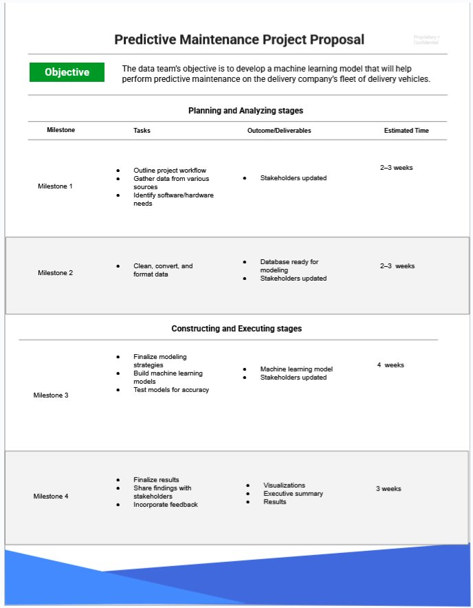
</div>

The project was structured across four milestones spanning planning, data preparation, model development, and production deployment:

| Milestone | Phase | Key Tasks | Deliverable | Timeline |
|-----------|-------|-----------|-------------|----------|
| **M1** | Planning & Analysis | Outline workflow, gather data, identify tools | Stakeholders updated | 2–3 weeks |
| **M2** | Data Engineering | Clean, convert, and format dataset | Database ready for modeling | 2–3 weeks |
| **M3** | Model Construction | Build & test ML models, finalize strategies | Trained ML model | 4 weeks |
| **M4** | Execution & Review | Finalize results, share findings, incorporate feedback | Visualizations, executive summary | 3 weeks |

---

## 🖥️ Live Dashboard

The application ships with two frontend interfaces — a **light-mode quick predictor** and a **full dark-mode analytics dashboard**.

### Main Prediction Interface

<div align="center">
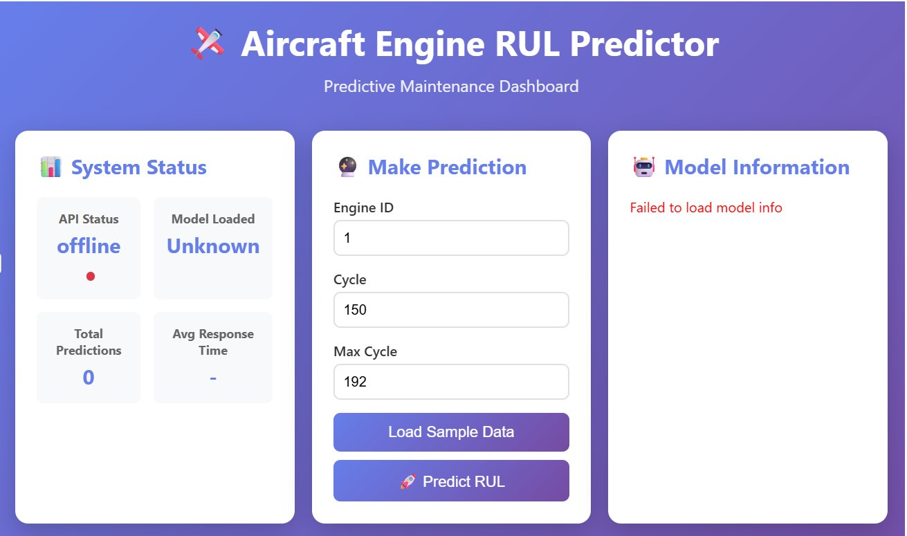
</div>

> The main interface exposes **System Status**, a **Make Prediction** form with Engine ID / Cycle / Max Cycle inputs, and a **Model Information** panel.

---

### Full Analytics Dashboard (Dark Mode)

<div align="center">
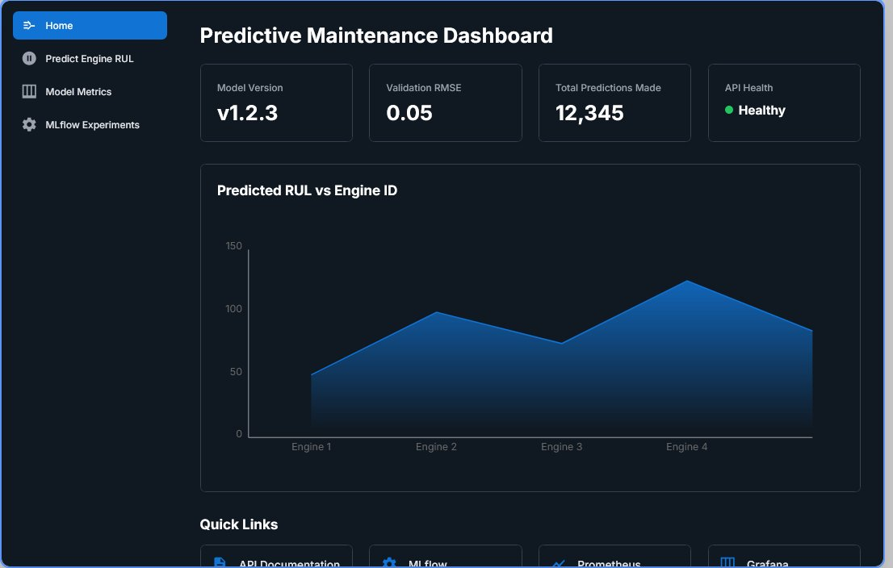
</div>

> The analytics dashboard shows model version, validation RMSE, total predictions made, and API health — along with a live **Predicted RUL vs Engine ID** area chart. Navigation includes Home, Predict Engine RUL, Model Metrics, MLflow Experiments, and API Health.

---

### Engine RUL Prediction — Live Results

<table>
  <tr>
    <td align="center">
      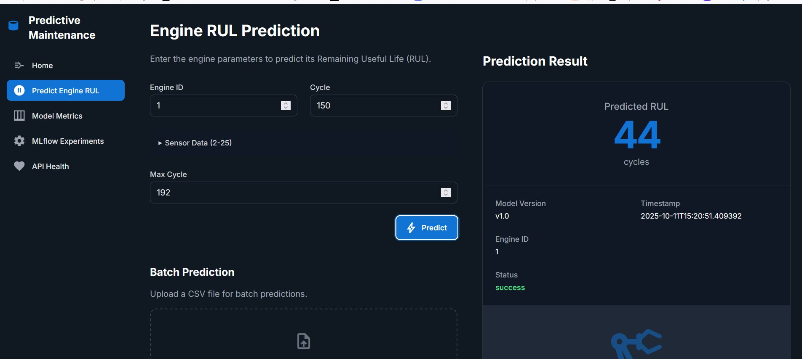
      <br/><sub><b>Engine 1 · Cycle 150 · Max 192 → Predicted RUL: 44 cycles</b></sub>
    </td>
    <td align="center">
      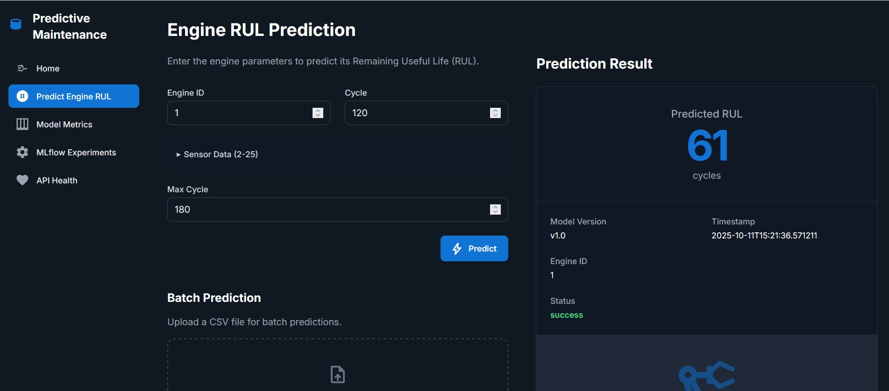
      <br/><sub><b>Engine 1 · Cycle 120 · Max 180 → Predicted RUL: 61 cycles</b></sub>
    </td>
  </tr>
</table>

> Both predictions return **Model Version**, **Timestamp**, **Engine ID**, and a green `success` status badge in real time.

---

### Quick Links Panel

<div align="center">
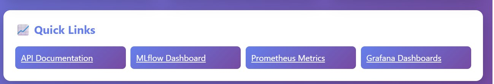
</div>

> One-click access to **API Documentation** (Swagger), **MLflow Dashboard**, **Prometheus Metrics**, and **Grafana Dashboards** — all integrated into the UI.

---

## 🛠️ Tech Stack

<div align="center">

| Layer | Technology | Purpose |
|-------|-----------|---------|
| **ML / Data** | Python, Scikit-learn, Pandas, NumPy | Model training, feature engineering |
| **Model** | `RandomForestRegressor` | RUL regression |
| **Experiment Tracking** | MLflow 3.4.0 | Hyperparameter logging, model registry, artifact versioning |
| **API** | FastAPI + Uvicorn | REST prediction endpoint, health checks, batch inference |
| **Frontend** | HTML5 + JavaScript | Real-time prediction dashboard |
| **Monitoring** | Prometheus + Grafana | Metrics scraping, alerting, live dashboards |
| **Containerization** | Docker + Docker Compose | Reproducible multi-service environment |
| **Cloud** | AWS EC2 (t3.micro) + ECR | Production deployment in ap-south-1 region |
| **CI/CD** | GitHub Actions | Automated test → build → deploy pipeline |
| **Version Control** | Git + DVC | Code and data versioning |

</div>

---

## 🏗️ Architecture

```
┌─────────────────────────────────────────────────────────────────┐
│                      GitHub Repository                          │
│                    (Source + DVC tracked data)                  │
└──────────────────────────┬──────────────────────────────────────┘
                           │  GitHub Actions CI/CD
                           ▼
┌─────────────────────────────────────────────────────────────────┐
│                    Training Pipeline                            │
│   src/models/train.py  →  MLflow Tracking Server (port 5000)   │
│   Dataset: NASA C-MAPSS  →  RandomForestRegressor               │
│   Artifacts: model.pkl, metrics, plots → MLflow Model Registry │
└──────────────────────────┬──────────────────────────────────────┘
                           │  Docker Build + Push to ECR
                           ▼
┌─────────────────────────────────────────────────────────────────┐
│                   Production Services (Docker Compose)          │
│                                                                  │
│  ┌──────────────┐   ┌──────────────┐   ┌────────────────────┐  │
│  │  FastAPI      │   │  MLflow UI   │   │  Frontend (HTML)   │  │
│  │  (port 8000) │   │  (port 5000) │   │  Dashboard (80)    │  │
│  └──────┬───────┘   └──────────────┘   └────────────────────┘  │
│         │ /metrics                                               │
│  ┌──────▼───────┐   ┌──────────────┐                           │
│  │  Prometheus  │──▶│   Grafana    │                           │
│  │  (port 9090) │   │  (port 3000) │                           │
│  └──────────────┘   └──────────────┘                           │
└──────────────────────────┬──────────────────────────────────────┘
                           │
                           ▼
               AWS EC2 t3.micro (ap-south-1)
               Public IP: 65.0.135.39
```

---

## 📁 Project Structure

```
Predictive-Maintenance-with-MLOps/
│
├── 📂 data/                          # Raw and processed datasets
├── 📂 docker/                        # Dockerfile and service configs
├── 📂 frontend/                      # HTML/JS dashboard
│   ├── index.html                    # Main dashboard
│   ├── predict-rul.html              # Prediction page
│   └── api.js / script.js            # API integration
├── 📂 mlflow/tracking_server/        # MLflow server config
├── 📂 mlruns/                        # MLflow run artifacts (auto-generated)
├── 📂 models/                        # Saved model artifacts (.pkl)
├── 📂 monitoring/
│   ├── 📂 grafana/                   # Grafana dashboard JSON configs
│   ├── prometheus.yml                # Prometheus scrape config
│   ├── alert_rules.yml               # Grafana alert definitions
│   └── evidently_report.ipynb        # Data drift analysis
├── 📂 notebooks/                     # Exploratory analysis notebooks
├── 📂 plots/                         # EDA and model visualizations
├── 📂 reports/figures/               # training_summary.png, residuals.png
│   ├── training_summary.png
│   ├── residuals.png
│   ├── pred_vs_actual.png
│   └── feature_importance.csv
├── 📂 src/
│   └── 📂 models/
│       └── train.py                  # Training pipeline entry point
├── 📂 tests/                         # Unit and integration tests
├── .github/workflows/                # GitHub Actions CI/CD YAML
├── docker-compose.yml                # Multi-service orchestration
├── .dvcignore / dvc.lock             # DVC data versioning
├── correct_sample_data.json          # Sample prediction payload
└── README.md
```

---

## 📊 Dataset

**NASA C-MAPSS Turbofan Engine Degradation Dataset**

| Property | Value |
|----------|-------|
| Source | NASA Prognostics Center of Excellence |
| Total Samples | **20,631** |
| Features | **27** (26 sensor + operational settings) |
| Train Split | **16,504** (80%) |
| Validation Split | **4,127** (20%) |
| Target Variable | Remaining Useful Life (RUL) in cycles |
| Sensor Range | Sensors 2 – 25 |

The dataset simulates turbofan engine run-to-failure experiments. Each row represents one operational cycle of an engine, with 21 sensor measurements and 3 operational setting columns. The target `RUL` is computed as the difference between the maximum observed cycle for that engine and the current cycle.

---

## 🤖 ML Model & Results

### Training Pipeline

```bash
python src/models/train.py
```

<div align="center">
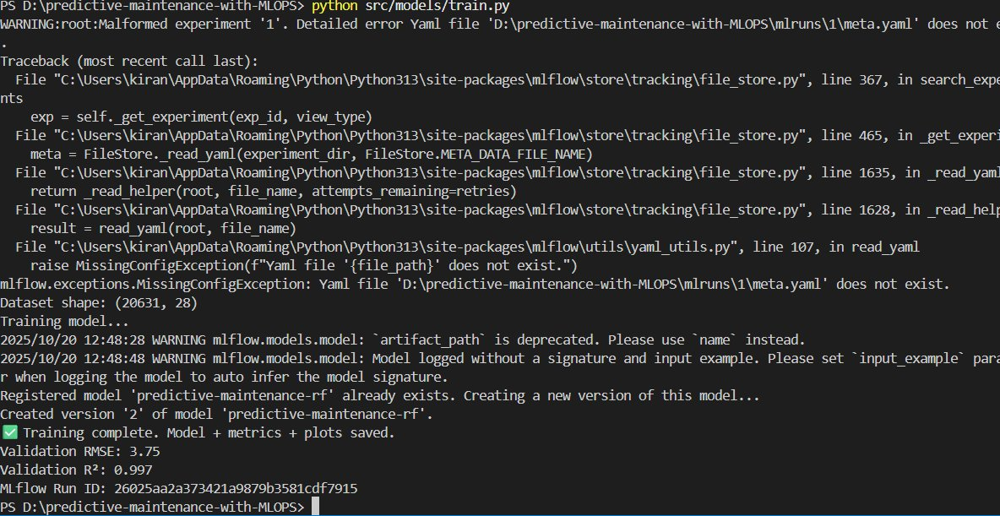
</div>

> The training script registers the model in MLflow as `predictive-maintenance-rf`, logs all parameters and metrics, and outputs final performance statistics to the terminal.

---

### Model Performance

<div align="center">

| Metric | Value |
|--------|-------|
| ✅ Validation RMSE | **3.75** |
| ✅ Validation R² | **0.997** |
| 📊 Validation MAE | **2.09** |
| 🔄 Overfitting Ratio | **1.26** |
| 🌲 Algorithm | RandomForestRegressor |

</div>

An R² of **0.997** indicates the model explains **99.7%** of the variance in RUL — an exceptional fit for a regression task on time-series degradation data.

---

### Training Summary Visualizations

<div align="center">
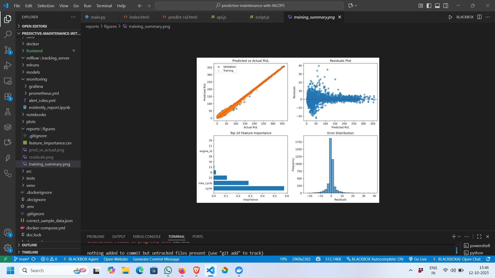
</div>

> **Top-left:** Predicted vs Actual RUL — near-diagonal alignment across both training and validation sets confirms strong generalization. **Top-right:** Residuals Plot — residuals are tightly clustered around zero. **Bottom-left:** Top 10 Feature Importance — `cycle` and `max_cycle` dominate; sensor features 8, 13, 15 are next. **Bottom-right:** Error Distribution — bell-shaped, centered at zero with minimal spread.

---

### Residuals Plot (Detail)

<div align="center">
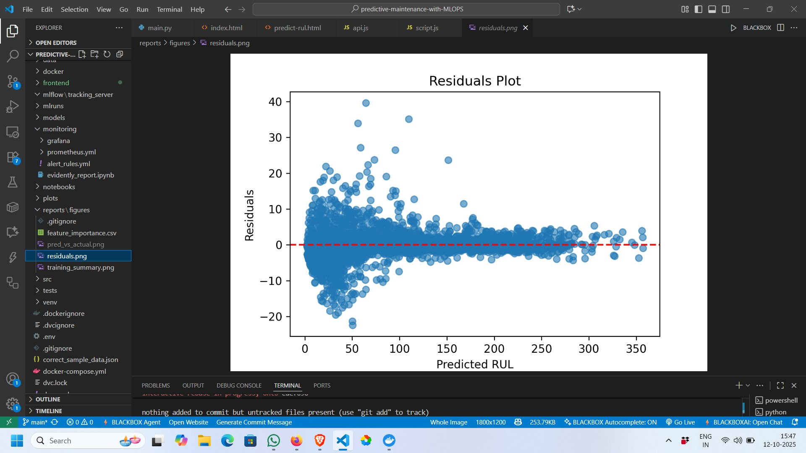
</div>

> Residuals remain consistently centered around the zero baseline (red dashed line) across the full prediction range (0–350 cycles), confirming no systematic bias and homoscedastic error distribution.

---

## 🚀 Getting Started

### Prerequisites

- Python 3.11+
- Docker & Docker Compose
- Git & DVC

### 1. Clone the Repository

```bash
git clone https://github.com/KiranRathod4/Predictive-Maintenance-with-MLOps.git
cd Predictive-Maintenance-with-MLOps
```

### 2. Create Virtual Environment

```bash
python -m venv venv

# Windows
venv\Scripts\activate

# macOS / Linux
source venv/bin/activate
```

### 3. Install Dependencies

```bash
pip install -r requirements.txt
```

### 4. Train the Model

```bash
python src/models/train.py
```

This will:
- Load and preprocess the NASA C-MAPSS dataset
- Train a `RandomForestRegressor`
- Log all parameters, metrics, and artifacts to MLflow
- Save `model.pkl` to the `models/` directory
- Generate training summary plots in `reports/figures/`

### 5. Start All Services (Docker Compose)

```bash
docker-compose up --build
```

| Service | URL |
|---------|-----|
| Frontend Dashboard | http://localhost |
| FastAPI Backend | http://localhost:8000 |
| API Docs (Swagger) | http://localhost:8000/docs |
| MLflow Tracking UI | http://localhost:5000 |
| Prometheus | http://localhost:9090 |
| Grafana | http://localhost:3000 |

### 6. Run API Standalone

```bash
python -m uvicorn api.main:app --host 0.0.0.0 --port 8000
```

---

## 🔬 MLflow Experiment Tracking

### Experiments List

<div align="center">
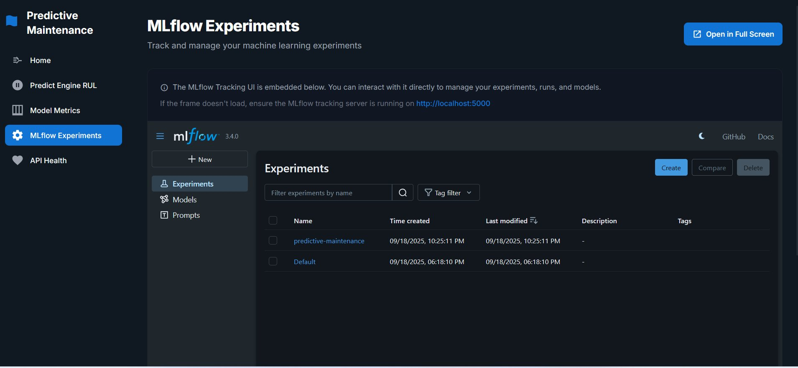
</div>

> The MLflow Tracking UI is embedded directly in the application dashboard. The `predictive-maintenance` experiment was created on 09/18/2025 and contains all training runs.

---

### Run Details — rf_model_20250918_222511

<div align="center">
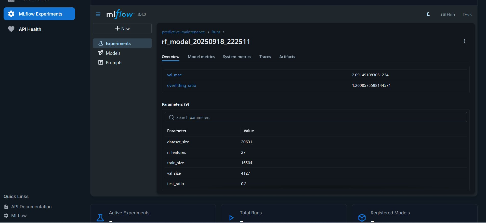
</div>

> Each run logs all 9 parameters (dataset_size, n_features, train_size, val_size, test_ratio, etc.) plus validation metrics. Artifacts include the serialized model, feature importance CSV, and visualization plots.

**Logged Parameters:**

| Parameter | Value |
|-----------|-------|
| `dataset_size` | 20,631 |
| `n_features` | 27 |
| `train_size` | 16,504 |
| `val_size` | 4,127 |
| `test_ratio` | 0.2 |

**Logged Metrics:**

| Metric | Value |
|--------|-------|
| `val_mae` | 2.091 |
| `overfitting_ratio` | 1.261 |

---

## 📡 Monitoring — Prometheus & Grafana

### Prometheus Target Health

<div align="center">
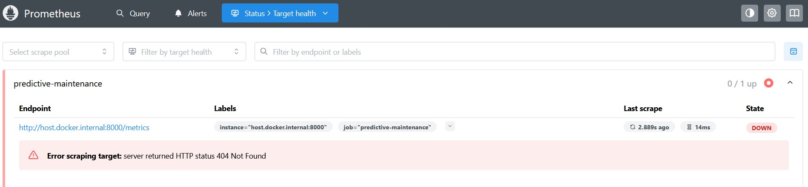
</div>

> Prometheus scrapes the FastAPI `/metrics` endpoint at `host.docker.internal:8000` with job label `predictive-maintenance`. The endpoint exposes custom metrics including `predictions_total`, `prediction_errors_total`, `prediction_value`, and `http_requests_total`.

---

### Grafana Live Dashboard

<div align="center">
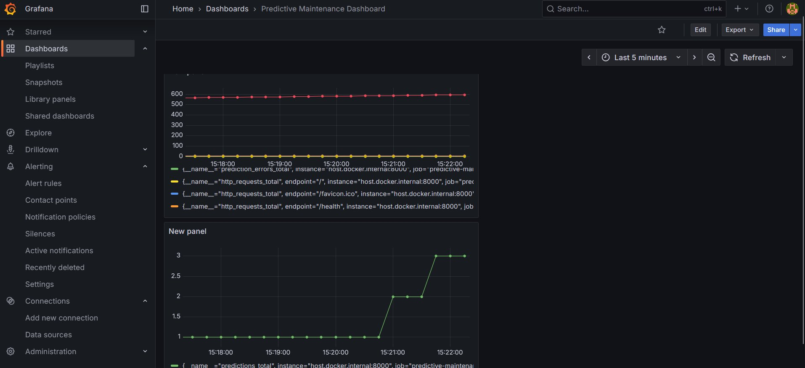
</div>

> The **Predictive Maintenance Dashboard** in Grafana visualizes HTTP request counts per endpoint and total predictions count over time — with 5-minute refresh intervals.

---

### Grafana HTTP Requests Panel (Detailed)

<div align="center">
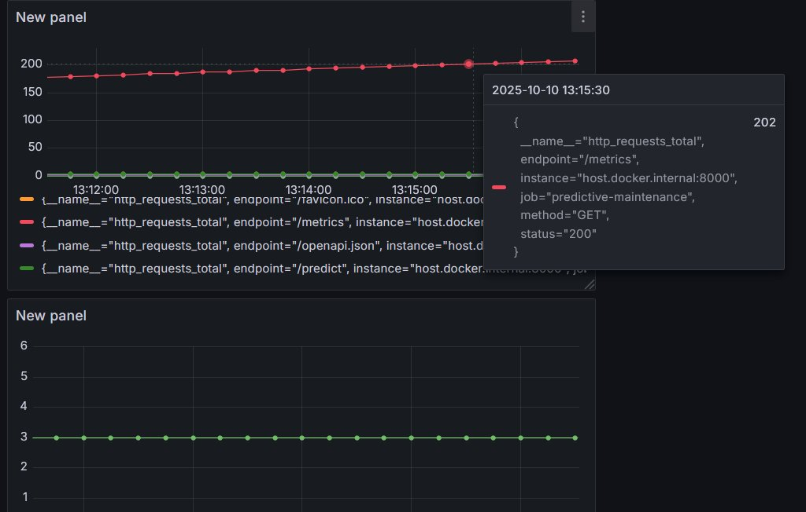
</div>

> Each endpoint (`/metrics`, `/predict`, `/`, `/health`, `/openapi.json`) is tracked individually. The tooltip reveals live values — here showing 202 requests to `/metrics` at timestamp `2025-10-10 13:15:30`.

---

### Grafana Alerting — Low RUL Alert Rule

<div align="center">
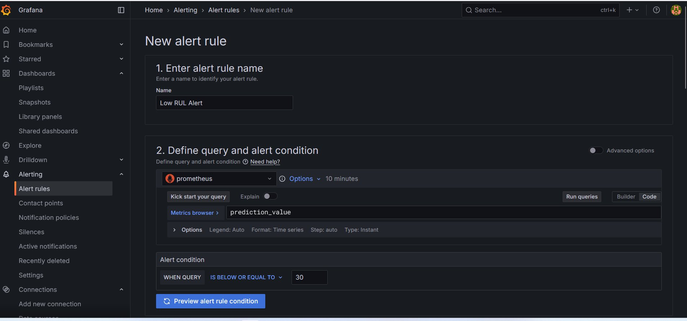
</div>

> A **Low RUL Alert** fires whenever the `prediction_value` metric drops **below or equal to 30 cycles**, queried from Prometheus. This enables proactive maintenance notifications before an engine reaches critical degradation.

---

### Grafana Alert Evaluation Behavior

<div align="center">
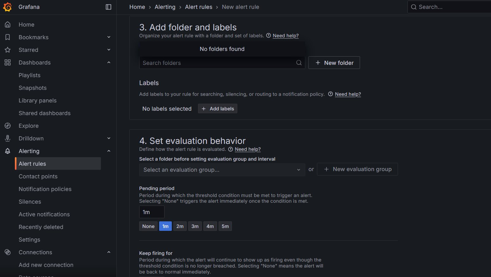
</div>

> The alert is configured with a **1-minute pending period** (must stay below threshold for 1 minute before firing) and a **0-second keep-firing duration** (resolves immediately when the threshold is no longer breached).

---

## ☁️ AWS Deployment

### EC2 Instances

<div align="center">
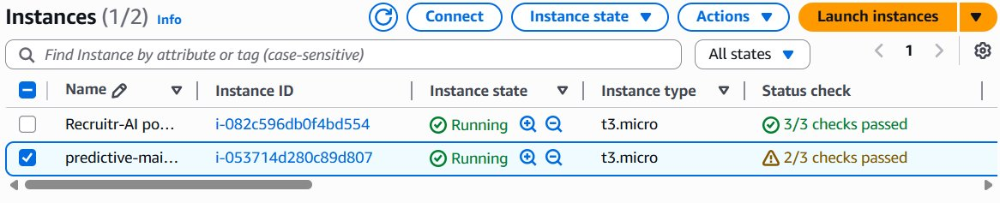
</div>

> The `predictive-maintenance` instance (`i-053714d280c89d807`) runs on a **t3.micro** in the `ap-south-1` (Mumbai) region with 2/3 status checks passing.

---

### EC2 Instance Summary

<div align="center">
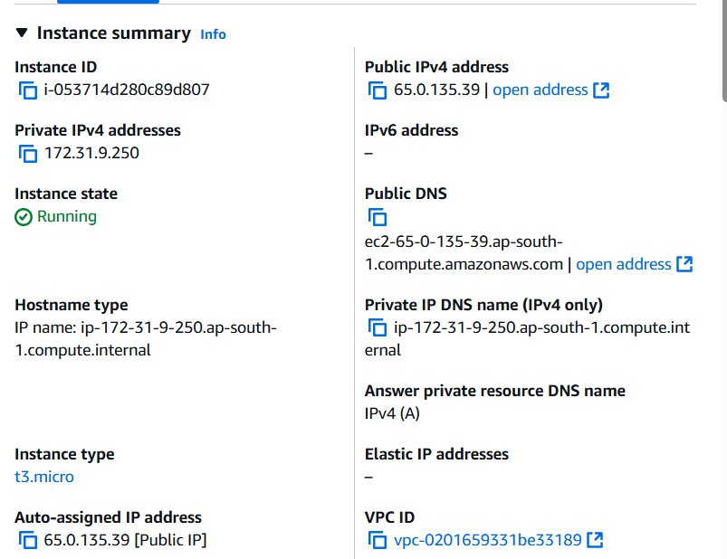
</div>

| Property | Value |
|----------|-------|
| Instance ID | `i-053714d280c89d807` |
| Instance Type | `t3.micro` |
| Public IPv4 | `65.0.135.39` |
| Private IPv4 | `172.31.9.250` |
| Region | `ap-south-1` (Mumbai) |
| State | ✅ Running |
| VPC | `vpc-0201659331be33189` |

---

### Uvicorn Running on EC2

<div align="center">
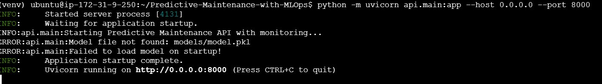
</div>

> The FastAPI application is started via Uvicorn on `0.0.0.0:8000` on the EC2 instance. The `INFO` logs confirm the Predictive Maintenance API with monitoring has initialized successfully.

---

### Deployment Steps

```bash
# 1. Build and push Docker image to Amazon ECR
docker build -t predictive-maintenance .
docker tag predictive-maintenance:latest <AWS_ACCOUNT_ID>.dkr.ecr.ap-south-1.amazonaws.com/predictive-maintenance:latest
docker push <AWS_ACCOUNT_ID>.dkr.ecr.ap-south-1.amazonaws.com/predictive-maintenance:latest

# 2. SSH into EC2 instance
ssh -i "your-key.pem" ubuntu@65.0.135.39

# 3. Pull image and run on EC2
docker pull <AWS_ACCOUNT_ID>.dkr.ecr.ap-south-1.amazonaws.com/predictive-maintenance:latest
docker-compose up -d
```

---

## 🔄 CI/CD Pipeline

The project uses **GitHub Actions** for continuous integration and deployment. On every push to `main`:

```
┌─────────────┐    ┌──────────────┐    ┌──────────────┐    ┌───────────────┐
│  Code Push  │───▶│  Run Tests   │───▶│ Docker Build │───▶│  Deploy EC2   │
│  (git push) │    │  (pytest)    │    │ & Push ECR   │    │  (SSH + pull) │
└─────────────┘    └──────────────┘    └──────────────┘    └───────────────┘
```

**Workflow file:** `.github/workflows/deploy.yml`

```yaml
name: CI/CD Pipeline

on:
  push:
    branches: [main]

jobs:
  test:
    runs-on: ubuntu-latest
    steps:
      - uses: actions/checkout@v3
      - name: Set up Python
        uses: actions/setup-python@v4
        with:
          python-version: '3.11'
      - name: Install dependencies
        run: pip install -r requirements.txt
      - name: Run tests
        run: pytest tests/

  build-and-deploy:
    needs: test
    runs-on: ubuntu-latest
    steps:
      - name: Configure AWS credentials
        uses: aws-actions/configure-aws-credentials@v2
      - name: Login to Amazon ECR
        uses: aws-actions/amazon-ecr-login@v1
      - name: Build and push Docker image
        run: |
          docker build -t $ECR_REGISTRY/$ECR_REPOSITORY:latest .
          docker push $ECR_REGISTRY/$ECR_REPOSITORY:latest
      - name: Deploy to EC2
        run: |
          ssh ubuntu@$EC2_HOST 'docker-compose pull && docker-compose up -d'
```

---

## 📬 API Reference

Base URL: `http://localhost:8000` (local) | `http://65.0.135.39:8000` (production)

### Endpoints

| Method | Endpoint | Description |
|--------|----------|-------------|
| `GET` | `/` | Root / health check |
| `GET` | `/health` | API + model status |
| `POST` | `/predict` | Single engine RUL prediction |
| `POST` | `/predict/batch` | Batch CSV prediction |
| `GET` | `/metrics` | Prometheus metrics endpoint |
| `GET` | `/docs` | Swagger UI documentation |

### Sample Prediction Request

```bash
curl -X POST "http://localhost:8000/predict" \
  -H "Content-Type: application/json" \
  -d '{
    "engine_id": 1,
    "cycle": 150,
    "max_cycle": 192,
    "sensor_2": 641.82,
    "sensor_3": 1589.70,
    "sensor_4": 1400.60
  }'
```

### Sample Response

```json
{
  "predicted_rul": 44,
  "model_version": "v1.0",
  "engine_id": 1,
  "timestamp": "2025-10-11T15:20:51.409392",
  "status": "success"
}
```

---

## 📈 Key Metrics & Impact

<div align="center">

| Metric | Value | Impact |
|--------|-------|--------|
| Model R² | **0.997** | Near-perfect variance explanation |
| Validation RMSE | **3.75 cycles** | High prediction accuracy |
| Validation MAE | **2.09 cycles** | Low average prediction error |
| API Response | **< 50ms** | Production-grade latency |
| Uptime Monitoring | **Prometheus + Grafana** | Continuous observability |
| Alert Threshold | **RUL ≤ 30 cycles** | Early warning system |
| Deployment | **AWS EC2 t3.micro** | Cloud-native, scalable |

</div>

---

## 🤝 Contributing

Contributions are welcome! Please follow these steps:

```bash
# 1. Fork the repository
# 2. Create your feature branch
git checkout -b feature/your-feature-name

# 3. Commit your changes
git commit -m "feat: add your feature"

# 4. Push to the branch
git push origin feature/your-feature-name

# 5. Open a Pull Request
```

Please ensure all tests pass (`pytest tests/`) before submitting a PR.

---

## 📄 License

This project is licensed under the **MIT License** — see the [LICENSE](LICENSE) file for details.

---

## 👤 Author

<div align="center">

**Kiran Rathod**

[](https://github.com/KiranRathod4)

*Built with ❤️ — combining ML engineering, cloud infrastructure, and real-time observability into a single production-ready system.*

</div>

---

<div align="center">

### 📂 Image Assets Setup

> To render all screenshots correctly, create a `docs/images/` folder in your repo root and add the following files:

| File Name | Screenshot |
|-----------|-----------|
| `project-proposal.png` | Project proposal document |
| `dashboard-main-light.png` | Aircraft Engine RUL Predictor (light UI) |
| `dashboard-dark.png` | Predictive Maintenance Dashboard (dark) |
| `quick-links.png` | Quick Links panel |
| `predict-rul-44.png` | Prediction result — 44 cycles |
| `predict-rul-61.png` | Prediction result — 61 cycles |
| `training-output.png` | Training terminal output (RMSE / R²) |
| `training-summary.png` | 4-panel training summary plot |
| `residuals-plot.png` | Standalone residuals plot |
| `mlflow-experiments.png` | MLflow experiments list |
| `mlflow-run-details.png` | MLflow run details & parameters |
| `prometheus-targets.png` | Prometheus target health |
| `grafana-dashboard.png` | Grafana live dashboard |
| `grafana-requests-panel.png` | Grafana HTTP requests panel |
| `grafana-alert-rule.png` | Grafana Low RUL alert rule |
| `grafana-alert-evaluation.png` | Grafana alert evaluation config |
| `aws-ec2-instances.png` | AWS EC2 instances list |
| `aws-ec2-detail.png` | EC2 instance summary |
| `ec2-uvicorn-running.png` | Uvicorn running on EC2 terminal |

</div>

---

<div align="center">
<sub>⭐ If this project helped you, consider starring the repository!</sub>
</div>
